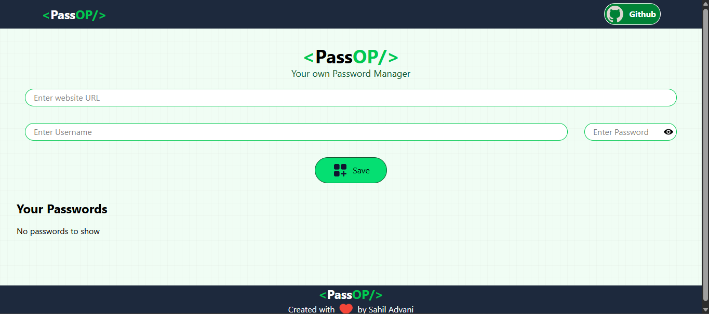

# 🔐 PassOP — Password Manager

PassOP is a simple password manager built with **React** that allows users to securely organize their website credentials directly in their browser.

Users can save a website URL, username, and password, then view, edit, delete, or copy their saved credentials whenever needed.

> **Note:** PassOP is a learning project. Credentials are stored in the browser's `localStorage` and are not synchronized with a backend or cloud database. Since `localStorage` is not encrypted storage, this project should not be used for storing highly sensitive passwords.

## ✨ Features

* 🔐 Store website credentials
* ➕ Add new passwords
* ✏️ Edit existing passwords
* 🗑️ Delete saved passwords
* 📋 Copy URL, username, and password individually
* 🔗 Open saved website URLs in a new browser tab
* 💾 Persistent storage using browser `localStorage`
* 🔄 Automatically loads saved credentials when the application starts
* 📱 Responsive user interface
* 🎨 Styled using Tailwind CSS
* ⚛️ Built with React
* ⭐ Icons provided by Lordicons

## 🛠️ Tech Stack

* **React** — UI development
* **Vite** — Development server and build tool
* **Tailwind CSS** — Styling
* **Lordicons** — UI icons
* **localStorage** — Client-side data persistence
* **JavaScript** — Application logic

## 📸 Preview

Add a screenshot of the application here.





## 🚀 Getting Started

### Prerequisites

Make sure you have the following installed:

* Node.js
* npm

### Installation

Clone the repository:

```bash
git clone https://github.com/SahilAdvani/passop.git
```

Navigate to the project:

```bash
cd passop
```

Install dependencies:

```bash
npm install
```

Start the development server:

```bash
npm run dev
```

The application will usually be available at:

```text
http://localhost:5173
```

## 📦 Build for Production

Create a production build:

```bash
npm run build
```

Preview the production build locally:

```bash
npm run preview
```

## 📁 Project Structure

```text
passop/
├── public/
├── src/
│   ├── assets/
│   ├── components/
│   ├── App.jsx
│   ├── index.css
│   └── main.jsx
├── .gitignore
├── index.html
├── package.json
├── package-lock.json
└── vite.config.js
```

## 💾 Data Storage

PassOP uses the browser's **localStorage** to store saved credentials.

The basic flow is:

```text
User enters credentials
        ↓
      PassOP
        ↓
   localStorage
        ↓
Credentials remain available
after page refresh
```

No backend database is used to store or synchronize the credentials.

### Important Security Note

Although the data remains in the browser and is not sent to a PassOP backend, `localStorage` should **not be considered secure password storage**.

The stored values are accessible to JavaScript running on the same origin and are not encrypted by `localStorage` itself.

For this reason, PassOP is intended as a **learning/demo project**, not as a production password manager.

## 🌐 Live Demo

[https://passop-ashen.vercel.app/](https://passop-ashen.vercel.app/)


## 👨‍💻 Author

**Sahil Advani**


## 📄 License

This project is licensed under the MIT License.
